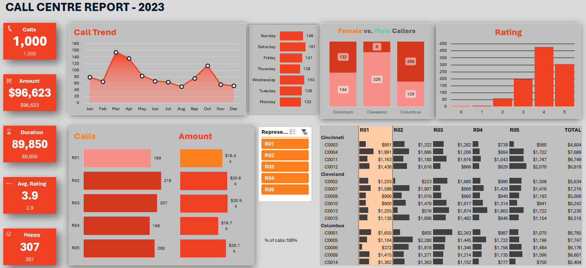

# Call Center Analytics Project – Excel-Based Dashboard and Analysis

## Project Overview

This project demonstrates data analytics skills using Microsoft Excel by analyzing a simulated call center dataset containing customer and call activity information. The objective is to extract operational insights, evaluate agent and customer-level performance, and present findings through a dynamic, interactive dashboard.

The project includes a structured Excel workbook for technical analysis, a manager-facing dashboard, and a presentation summarizing the key insights and recommendations.

---

Table of Contents

- [Objectives](#objectives)
- [Business Questions](#business-questions)
- [Dataset Overview](#dataset-overview)
- [Project Files](#project-files)
- [Dashboard Preview](#dashboard-preview)
- [Metrics and KPIs Tracked](#metrics-and-kpis-tracked)
- [Tools and Techniques](#tools-and-techniques)
- [Recommendations](#recommendations)
- [Project Structure](#project-structure)
- [Contact](#contact)

---

## Objectives

- Analyze overall call center activity, customer trends, and agent performance
- Build a dynamic dashboard for management-level reporting
- Identify areas of high and low performance across cities and agents
- Visualize trends over time, gender distribution, and service quality through ratings
- Package the insights into an accessible, presentation-ready format

---

## Business Questions

This project is designed to help address the following business-oriented questions:

- What is the total call volume and revenue generated by the call center?
- How does call activity vary across months and days of the week?
- Which agents are handling the most calls and generating the most revenue?
- What is the average customer satisfaction rating, and how is it distributed?
- Are there patterns in customer behavior by city or gender?
- Which areas (cities, agents, time periods) require attention or optimization?

---

## Dataset Overview

The dataset includes two key components:

- **Call Data**: Contains information such as call duration, agent ID, date, rating, and amount generated
- **Customer Data**: Includes customer gender and location details

These were merged, cleaned, and processed in Excel using formulas, filters, and pivot tables.

---

## Project Files

| File Name                                      | Description                                                                 |
|-----------------------------------------------|-----------------------------------------------------------------------------|
| `data_sheet.xlsx`                              | Raw merged data combining call and customer details                        |
| `call_center_analysis_final_worksheet.xlsx`    | Complete analysis workbook with:                                           |
|                                               | - Raw data overview                                                        |
|                                               | - Pivot tables and charts                                                  |
|                                               | - Dynamic dashboard with slicers                                           |
|                                               | - Manager-ready view of the project                                        |
| `final_dashboard_view.png`                    | Static preview of the interactive dashboard                                |
| `call_center_project_presentation.pptx`        | Final project presentation deck for reporting and sharing                  |

---

## Dashboard Preview

> Note: The dashboard is fully dynamic. All values update automatically based on slicers and filters (e.g., agent, city, month). The image shown below is only a static representation for reference.

---

## Metrics and KPIs Tracked

The analysis focuses on the following operational and performance metrics:

- Total number of calls
- Total call duration
- Total revenue (amount) generated
- Average customer rating
- Number of high-satisfaction calls (ratings ≥ 4)
- Call volume trends by month and weekday
- Gender distribution of callers
- Agent-level performance: volume, revenue, and ratings
- Customer distribution across cities

---

## Tools and Techniques

**Platform**: Microsoft Excel  
**Techniques and Features Used**:
- Pivot Tables and Pivot Charts
- Excel Formulas: `SUMIFS`, `COUNTIFS`, `AVERAGE`, logical conditions
- Slicers and dynamic filtering
- Conditional formatting
- Dashboard design for stakeholder reporting

---

## Recommendations

Based on the analysis framework and dashboard design:

1. Implement regular tracking of KPIs using this Excel model for ongoing performance management
2. Use city-wise and agent-wise breakdowns to identify areas for operational improvement
3. Schedule agents more effectively around peak call days and months
4. Encourage feedback collection to improve the accuracy of customer satisfaction metrics
5. Focus on agents with consistently lower ratings for potential training or support

---

call-center-performance-analysis-excel/
│
├── data/
│ └── data_sheet.xlsx
│
├── analysis/
│ └── call_center_analysis_final_worksheet.xlsx
│
├── presentation/
│ ├── call_center_project_presentation.pptx
│ └── final_dashboard_view.png
│
└── README.md

---

## Contact

**Author**: Rajdeep Ray  
- **Email**: rajdeepray.c48.it@gmail.com  
- **GitHub**: [github.com/deadlineZeus/call-center-performance-analysis-excel](https://github.com/deadlineZeus/call-center-performance-analysis-excel)  
- **LinkedIn**: [linkedin.com/in/rajdeep-ray-3616501b6](https://www.linkedin.com/in/rajdeep-ray-3616501b6/)  
- **Phone**: +91 7076918307

## Project Structure

